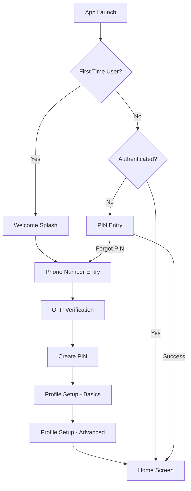
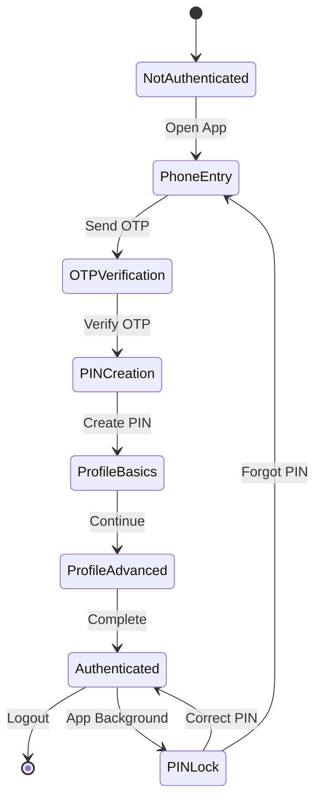
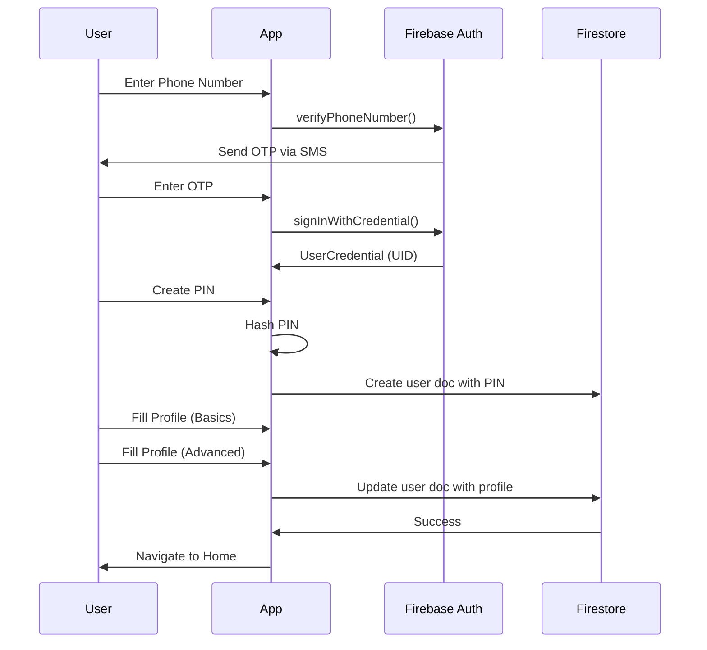
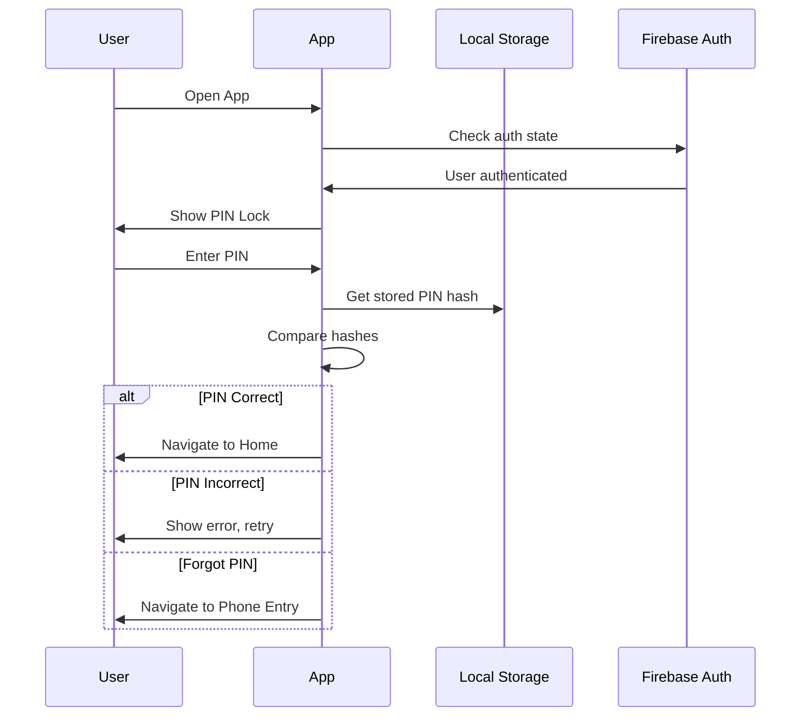

# Authentication & Profile Setup Flow

## Screen Flow Overview



---

## Screen Specifications

### 1. Welcome Splash Screen
**File**: `1. WelcomeSplash.png`

**Purpose**: Brand introduction and app value proposition

**Design Elements**:
- JEEVibe logo and branding
- Tagline/value proposition
- "Get Started" button
- Auto-dismiss after 2 seconds OR tap to continue

**Implementation**:
```dart
class WelcomeSplashScreen extends StatelessWidget {
  // Auto-navigate after 2 seconds
  // OR
  // Show "Get Started" button
}
```

---

### 2. Phone Number Entry Screen
**File**: `2. AuthFlow - Phone Number Entry.png`

**Purpose**: Collect user's phone number for OTP authentication

**UI Components**:
- Country code selector (default: +91 for India)
- Phone number input field (10 digits)
- "Send OTP" button
- Terms & Privacy Policy links

**Validation**:
- Phone number must be 10 digits (for India)
- Valid country code
- Not already registered (check Firebase)

**Firebase Action**:
```dart
await FirebaseAuth.instance.verifyPhoneNumber(
  phoneNumber: '+91$phoneNumber',
  verificationCompleted: (PhoneAuthCredential credential) {},
  verificationFailed: (FirebaseAuthException e) {},
  codeSent: (String verificationId, int? resendToken) {
    // Navigate to OTP screen
  },
  codeAutoRetrievalTimeout: (String verificationId) {},
);
```

---

### 3. OTP Verification Screen
**File**: `3. AuthFlow - OTP Verification.png`

**Purpose**: Verify phone number with OTP

**UI Components**:
- 6-digit OTP input boxes (individual boxes for each digit)
- Auto-focus next box on digit entry
- Timer countdown (60 seconds)
- "Resend OTP" button (enabled after timer expires)
- "Verify" button
- Edit phone number link

**Features**:
- Auto-submit when 6 digits entered
- Auto-read OTP from SMS (iOS/Android)
- Resend OTP functionality
- Error handling for invalid OTP

**Firebase Action**:
```dart
PhoneAuthCredential credential = PhoneAuthProvider.credential(
  verificationId: verificationId,
  smsCode: otpCode,
);

UserCredential userCredential = await FirebaseAuth.instance
    .signInWithCredential(credential);
```

---

### 4. Create PIN Screen
**File**: `4. AuthFlow - Create Your Pin.png`

**Purpose**: Set up 4-digit PIN for quick app unlock

**UI Components**:
- Title: "Create Your PIN"
- Subtitle: "Set a 4-digit PIN for quick access"
- 4-digit PIN input (masked dots)
- Numeric keypad (0-9)
- Biometric option toggle (Face ID / Fingerprint)

**Flow**:
1. Enter PIN (4 digits)
2. Confirm PIN (re-enter)
3. Optional: Enable biometric authentication
4. Store hashed PIN in Firestore

**Security**:
- Hash PIN before storing (bcrypt)
- Never store plain text PIN
- Validate PIN strength (no 1234, 0000, etc.)

**Firebase Action**:
```dart
// Hash PIN
String hashedPin = hashPin(pin);

// Store in Firestore
await FirebaseFirestore.instance
    .collection('users')
    .doc(uid)
    .set({'pin': hashedPin}, SetOptions(merge: true));
```

---

### 5. Student Profile Setup - Basics
**File**: `5. Student Profile Setup - Basics.png`
**Dropdown Details**: `5a. Student Profile Setup - Basics - Target Year Expanded.png`

**Purpose**: Collect essential student information

**Form Fields**:

1. **First Name** (Text input)
   - Required
   - Min 2 characters

2. **Last Name** (Text input)
   - Required
   - Min 2 characters

3. **Email** (Email input)
   - Optional
   - Validation: valid email format

4. **Date of Birth** (Date picker)
   - Required
   - Age validation: 14-25 years

5. **Gender** (Dropdown)
   - Options: Male, Female, Other, Prefer not to say
   - Required

6. **Current Class** (Dropdown)
   - Options: Class 11, Class 12, Dropper (12th Pass)
   - Required

7. **Target Exam** (Dropdown)
   - Options:
     - JEE Main
     - JEE Main + Advanced ⭐ (Most popular)
     - JEE Advanced
     - BITSAT
     - WBJEE
     - MHT CET
     - KCET
     - Other
   - Required

8. **Target Year** (Dropdown) - **See 5a.png for expanded view**
   - Options: 2025, 2026, 2027, 2028
   - Required
   - Default: Next year based on current class

**UI/UX**:
- Progress indicator: Step 1 of 2
- "Continue" button (enabled when all required fields filled)
- "Skip for now" option (not recommended)

**Validation**:
- All required fields must be filled
- Email format validation
- Age appropriate for target year

---

### 6. Student Profile Setup - Advanced
**File**: `6. Student Profile Setup - Advanced.png`
**Dropdown Details**: `6a. Student Profile Setup - Advanced - Branch Info.png`

**Purpose**: Collect detailed academic and study preferences

**Form Fields**:

1. **School Name** (Text input)
   - Optional
   - Autocomplete from common schools (future enhancement)

2. **City** (Text input)
   - Required
   - Autocomplete from Indian cities

3. **State** (Dropdown)
   - All Indian states + UTs
   - Required

4. **Coaching Institute** (Dropdown) - **See 6a.png for expanded view**
   - Options:
     - No Coaching
     - FIITJEE
     - Allen
     - Resonance
     - Aakash
     - Vibrant Academy
     - Physics Wallah
     - Unacademy
     - Vedantu
     - Sri Chaitanya
     - Narayana
     - Other
   - Optional

5. **Coaching Branch** (Text input)
   - Shown only if coaching institute selected
   - Optional
   - Example: "Kalu Sarai, Delhi"

6. **Study Mode** (Dropdown)
   - Options:
     - Self-study only
     - Coaching only
     - Coaching + Self-study ⭐ (Most common)
     - Online classes only
     - Hybrid (Online + Offline)
   - Required

7. **Preferred Language** (Dropdown)
   - Options:
     - English
     - Hindi
     - Bilingual (English + Hindi) ⭐
   - Required

8. **Weak Subjects** (Multi-select chips)
   - Options: Physics, Chemistry, Mathematics
   - Optional
   - Can select multiple

9. **Strong Subjects** (Multi-select chips)
   - Options: Physics, Chemistry, Mathematics
   - Optional
   - Can select multiple

**UI/UX**:
- Progress indicator: Step 2 of 2
- "Complete Profile" button
- "Back" button to return to basics
- Success animation on completion

**Post-Completion**:
- Mark `profileCompleted: true` in Firestore
- Show success message
- Navigate to Home Screen
- Optional: Show onboarding tour

---

## Authentication State Management

### User States:



### Session Management:

1. **First Launch**:
   - Show Welcome Splash → Phone Entry

2. **Returning User (Authenticated)**:
   - Show PIN Lock Screen
   - Verify PIN locally (compare hash)
   - If correct → Home Screen
   - If forgot → Phone Entry (re-authenticate)

3. **Session Timeout**:
   - After 15 minutes of inactivity → PIN Lock
   - After 24 hours → Full re-authentication

---

## Data Flow

### Registration Flow:



### Login Flow (Returning User):



---

## Error Handling

### Common Errors:

| Error | User Message | Action |
|-------|-------------|--------|
| Invalid phone number | "Please enter a valid 10-digit phone number" | Highlight field |
| OTP send failed | "Unable to send OTP. Please check your number and try again." | Retry button |
| Invalid OTP | "Incorrect OTP. Please try again." | Clear OTP, allow retry |
| OTP expired | "OTP expired. Please request a new one." | Show resend button |
| Network error | "No internet connection. Please check and try again." | Retry button |
| PIN mismatch | "PINs don't match. Please try again." | Clear confirm PIN |
| Weak PIN | "Please choose a stronger PIN (avoid 1234, 0000, etc.)" | Suggest alternatives |

---

## Security Considerations

1. **Phone Verification**:
   - Use Firebase Phone Auth (built-in security)
   - Rate limiting on OTP requests
   - Verify phone number format before sending OTP

2. **PIN Security**:
   - Hash PIN with bcrypt (salt rounds: 10)
   - Never transmit plain PIN
   - Limit PIN attempts (5 max, then require re-auth)
   - Auto-lock after inactivity

3. **Session Management**:
   - Use Firebase Auth tokens (auto-refresh)
   - Implement token expiry
   - Secure storage for sensitive data

4. **Data Privacy**:
   - Encrypt sensitive profile data
   - GDPR compliance (data deletion)
   - Clear privacy policy

---

## Testing Checklist

### Phone Number Entry:
- [ ] Valid Indian number (+91)
- [ ] Valid US number (+1) for testing
- [ ] Invalid format rejection
- [ ] Country code selector works
- [ ] Terms & Privacy links work

### OTP Verification:
- [ ] Auto-read OTP (iOS/Android)
- [ ] Manual OTP entry
- [ ] Resend OTP after timeout
- [ ] Invalid OTP error
- [ ] Edit phone number link

### PIN Creation:
- [ ] PIN entry and confirmation
- [ ] PIN mismatch error
- [ ] Weak PIN rejection
- [ ] Biometric toggle (if available)
- [ ] PIN stored securely

### Profile Setup:
- [ ] All dropdowns populated
- [ ] Form validation
- [ ] Required field enforcement
- [ ] Multi-select chips work
- [ ] Progress indicator updates
- [ ] Back navigation works
- [ ] Data saved to Firestore

### Session Management:
- [ ] PIN lock on app background
- [ ] Correct PIN unlocks
- [ ] Forgot PIN flow
- [ ] Session timeout
- [ ] Logout functionality

---

## Next Steps

1. Review this auth flow design
2. Set up Firebase project
3. Implement authentication screens (6 screens)
4. Integrate Firebase Auth SDK
5. Implement PIN lock mechanism
6. Test on iOS and Android
7. Test with India and US phone numbers
