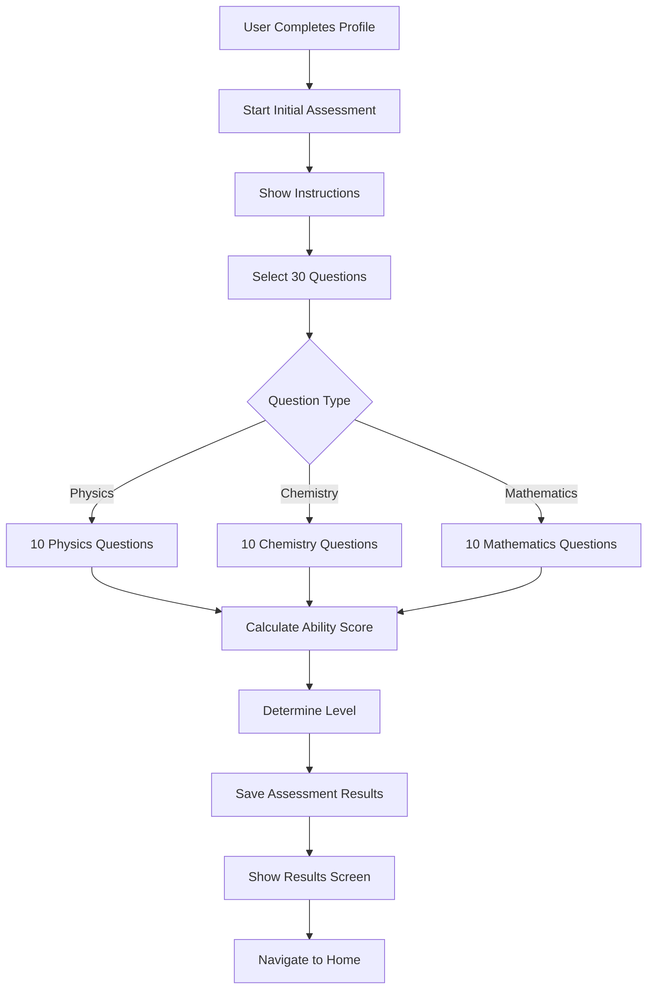
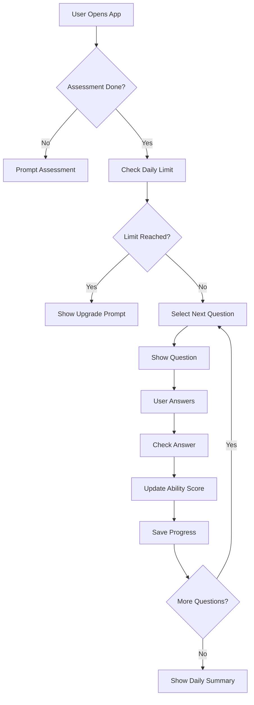
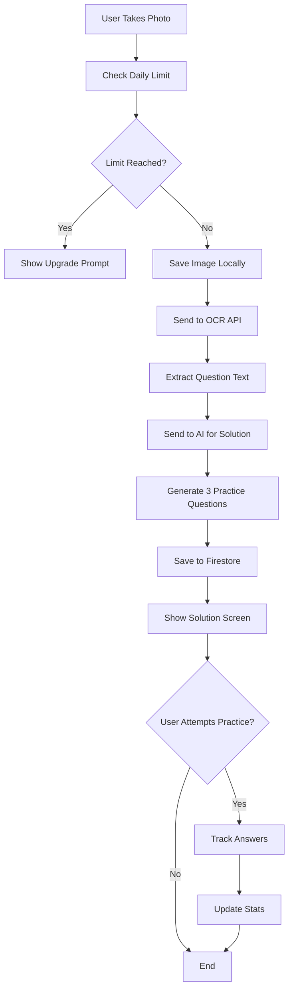

# JEEVibe Database Design V2 - Adaptive Learning Platform

## Product Overview (Updated)

### Core Features:

1. **Initial Assessment** (30 questions)
   - Taken after user registration
   - 10 questions each: Physics, Chemistry, Mathematics
   - Determines student's current level
   - One-time assessment

2. **Daily Adaptive Questions** (Primary Feature)
   - Questions from curated question bank (1000+ per subject)
   - Adaptive difficulty based on user's level
   - Tracks progress over time
   - Daily limits: Free vs Pro tier

3. **Snap & Solve** (Secondary Feature)
   - User uploads their own questions
   - AI solves + provides 3 practice questions
   - Daily limit: 5 snaps for free users
   - Stored locally, not in cloud

### User Tiers:

| Feature | Free Tier | Pro Tier |
|---------|-----------|----------|
| Initial Assessment | ✅ 30 questions | ✅ 30 questions |
| Daily Adaptive Questions | 10/day | Unlimited |
| Snap & Solve | 5/day | 20/day |
| Question Bank Access | ✅ All | ✅ All |
| Progress Tracking | ✅ Basic | ✅ Advanced |
| Analytics | ✅ Basic | ✅ Detailed |

---

## Updated Database Schema

### 1. User Profile (Enhanced)

**Collection**: `users`
**Document ID**: Firebase Auth UID

```javascript
{
  // ... (existing fields from V1)
  
  // Assessment Status
  "assessmentCompleted": false,
  "assessmentDate": null, // Timestamp when completed
  "assessmentScore": {
    "physics": 0,      // out of 10
    "chemistry": 0,    // out of 10
    "mathematics": 0   // out of 10
  },
  
  // Current Level (determined by assessment)
  "currentLevel": {
    "physics": "beginner",      // beginner, intermediate, advanced
    "chemistry": "beginner",
    "mathematics": "beginner"
  },
  
  // IRT-based ability scores (more granular)
  "abilityScore": {
    "physics": 0.0,        // -3 to +3 (IRT theta)
    "chemistry": 0.0,
    "mathematics": 0.0
  },
  
  // Subscription Tier
  "tier": "free",              // free, pro
  "proExpiryDate": null,
  "proStartDate": null,
  
  // Daily Limits
  "dailyLimits": {
    "adaptiveQuestions": 10,   // 10 for free, unlimited for pro
    "snapAndSolve": 5          // 5 for free, 20 for pro
  }
}
```

---

### 2. Initial Assessment

**Collection**: `users/{uid}/initialAssessment`
**Document ID**: "assessment" (single document)

```javascript
{
  "uid": "firebase_auth_uid",
  "startedAt": Timestamp,
  "completedAt": Timestamp,
  "totalQuestions": 30,
  "totalCorrect": 18,
  "totalIncorrect": 12,
  "accuracy": 60.0,
  
  // Subject-wise breakdown
  "subjectScores": {
    "physics": {
      "correct": 6,
      "incorrect": 4,
      "accuracy": 60.0,
      "estimatedLevel": "intermediate",
      "abilityScore": 0.5  // IRT theta
    },
    "chemistry": {
      "correct": 7,
      "incorrect": 3,
      "accuracy": 70.0,
      "estimatedLevel": "intermediate",
      "abilityScore": 0.8
    },
    "mathematics": {
      "correct": 5,
      "incorrect": 5,
      "accuracy": 50.0,
      "estimatedLevel": "beginner",
      "abilityScore": 0.0
    }
  },
  
  // Questions asked (for reference)
  "questions": [
    {
      "questionId": "PHY_LOM_E_001",
      "subject": "Physics",
      "difficulty": "easy",
      "userAnswer": "B",
      "correctAnswer": "B",
      "isCorrect": true,
      "timeTaken": 45  // seconds
    }
    // ... 29 more questions
  ],
  
  // Recommendations
  "recommendations": {
    "focusAreas": ["Physics - Laws of Motion", "Mathematics - Calculus"],
    "suggestedDailyGoal": 15  // questions per day
  }
}
```

---

### 3. Daily Adaptive Questions

**Collection**: `users/{uid}/dailyPractice`
**Document ID**: Date string (YYYY-MM-DD)

```javascript
{
  "date": "2024-12-07",
  "uid": "firebase_auth_uid",
  
  // Daily limits
  "questionsAttempted": 8,
  "questionsLimit": 10,      // Based on tier
  "questionsRemaining": 2,
  
  // Performance today
  "correct": 6,
  "incorrect": 2,
  "accuracy": 75.0,
  "totalTime": 480,  // seconds
  
  // Subject distribution
  "subjectBreakdown": {
    "physics": {
      "attempted": 3,
      "correct": 2,
      "incorrect": 1
    },
    "chemistry": {
      "attempted": 3,
      "correct": 2,
      "incorrect": 1
    },
    "mathematics": {
      "attempted": 2,
      "correct": 2,
      "incorrect": 0
    }
  },
  
  // Questions attempted today
  "questions": [
    {
      "questionId": "PHY_LOM_M_005",
      "subject": "Physics",
      "chapter": "Laws of Motion",
      "difficulty": "medium",
      "difficultyIRT": 1.2,
      "userAnswer": "C",
      "correctAnswer": "C",
      "isCorrect": true,
      "timeTaken": 65,
      "timestamp": Timestamp,
      "abilityEstimate": 0.6  // Updated ability after this question
    }
    // ... more questions
  ],
  
  // Adaptive algorithm state
  "nextQuestionDifficulty": 1.3,  // IRT difficulty for next question
  "currentAbility": {
    "physics": 0.6,
    "chemistry": 0.8,
    "mathematics": 0.3
  }
}
```

---

### 4. Snap & Solve History (Updated - Local Storage)

**Collection**: `users/{uid}/snapHistory`
**Document ID**: Auto-generated

```javascript
{
  "snapId": "auto_generated_id",
  "uid": "firebase_auth_uid",
  "timestamp": Timestamp,
  "date": "2024-12-07",
  
  // Image stored LOCALLY (not in cloud)
  "localImagePath": "/path/to/local/image.jpg",  // Local file path
  "imageStoredLocally": true,
  
  // Question Info (from OCR)
  "questionText": "A body of mass 5 kg...",
  "ocrConfidence": 0.95,
  
  // Classification (from AI)
  "subject": "Physics",
  "chapter": "Laws of Motion",
  "topic": "Newton's Second Law",
  "estimatedDifficulty": "medium",
  
  // Solution (from AI)
  "solutionText": "Using Newton's second law...",
  "solutionSteps": [...],
  
  // Practice Questions (3 similar questions from AI)
  "practiceQuestions": [
    {
      "questionText": "A block of mass 3 kg...",
      "options": [...],
      "correctAnswer": "B",
      "solution": "...",
      "userAnswer": null,  // null if not attempted
      "isCorrect": null
    }
    // ... 2 more questions
  ],
  
  // Practice completion
  "practiceCompleted": false,
  "practiceScore": 0,  // out of 3
  
  // Metadata
  "processingTime": 3.5,
  "aiModel": "gpt-4-vision"
}
```

**Note**: Images are stored locally on device, not uploaded to cloud. This saves storage costs and is faster.

---

### 5. Daily Snap Counter (Updated)

**Collection**: `users/{uid}/dailySnapCounter`
**Document ID**: Date string (YYYY-MM-DD)

```javascript
{
  "date": "2024-12-07",
  "snapsUsed": 3,
  "snapLimit": 5,          // 5 for free, 20 for pro
  "snapsRemaining": 2,
  "resetAt": Timestamp,    // Midnight local time
  "snapIds": ["snap_1", "snap_2", "snap_3"]
}
```

---

### 6. User Progress Tracking (Enhanced)

**Collection**: `userProgress/{uid}`
**Document ID**: Firebase Auth UID

```javascript
{
  "uid": "firebase_auth_uid",
  "lastUpdated": Timestamp,
  
  // Overall Progress
  "totalQuestionsAttempted": 450,
  "totalCorrect": 320,
  "totalIncorrect": 130,
  "overallAccuracy": 71.1,
  
  // Current Ability Levels (IRT theta)
  "currentAbility": {
    "physics": 0.6,
    "chemistry": 0.8,
    "mathematics": 0.3
  },
  
  // Level Classification
  "currentLevel": {
    "physics": "intermediate",      // beginner: -1 to 0, intermediate: 0 to 1, advanced: 1+
    "chemistry": "intermediate",
    "mathematics": "beginner"
  },
  
  // Progress Over Time (weekly snapshots)
  "progressHistory": [
    {
      "week": "2024-W49",
      "ability": {
        "physics": 0.4,
        "chemistry": 0.6,
        "mathematics": 0.2
      },
      "questionsAttempted": 50,
      "accuracy": 68.0
    }
    // ... more weeks
  ],
  
  // Subject-wise detailed stats
  "subjectStats": {
    "physics": {
      "questionsAttempted": 150,
      "correct": 100,
      "incorrect": 50,
      "accuracy": 66.7,
      "currentAbility": 0.6,
      "level": "intermediate",
      "timeSpent": 7200,  // seconds
      "lastPracticed": Timestamp,
      
      // Chapter-wise breakdown
      "chapterStats": {
        "laws_of_motion": {
          "attempted": 25,
          "correct": 18,
          "accuracy": 72.0,
          "avgDifficulty": 1.2
        }
        // ... more chapters
      },
      
      // Difficulty-wise breakdown
      "difficultyStats": {
        "easy": { "attempted": 60, "correct": 54, "accuracy": 90.0 },
        "medium": { "attempted": 70, "correct": 40, "accuracy": 57.1 },
        "hard": { "attempted": 20, "correct": 6, "accuracy": 30.0 }
      }
    }
    // ... chemistry, mathematics
  },
  
  // Weak Areas (for targeted practice)
  "weakAreas": [
    {
      "subject": "Physics",
      "chapter": "Laws of Motion",
      "topic": "Friction",
      "accuracy": 45.0,
      "needsPractice": true
    }
    // ... more weak areas
  ],
  
  // Strong Areas
  "strongAreas": [
    {
      "subject": "Chemistry",
      "chapter": "Organic Chemistry",
      "accuracy": 85.0
    }
    // ... more strong areas
  ],
  
  // Streaks
  "currentStreak": 7,      // days
  "longestStreak": 15,
  "lastPracticeDate": "2024-12-07",
  
  // Snap & Solve Stats
  "snapStats": {
    "totalSnaps": 45,
    "practiceQuestionsAttempted": 120,  // 3 per snap, not all completed
    "practiceAccuracy": 65.0
  }
}
```

---

### 7. Question Bank (Enhanced)

**Collection**: `questionBank/{subject}/questions`
**Document ID**: Question ID (e.g., "PHY_LOM_E_001")

```javascript
{
  // ... (all existing fields from V1)
  
  // Adaptive Learning Metadata
  "adaptiveMetadata": {
    "usedInAssessment": false,     // Can be used in initial assessment
    "usedInDailyPractice": true,   // Can be used in daily practice
    "tier": "free",                // free, pro (pro-only questions)
    "priority": "HIGH"             // HIGH, MEDIUM, LOW
  },
  
  // Usage Stats (updated in real-time)
  "usageStats": {
    "timesShown": 1250,
    "timesCorrect": 890,
    "timesIncorrect": 360,
    "avgTimeTaken": 58,
    "accuracyRate": 71.2,
    "lastShown": Timestamp,
    
    // IRT Calibration (updated periodically)
    "irtDifficulty": 1.2,          // b parameter (difficulty)
    "irtDiscrimination": 1.5,      // a parameter (how well it discriminates)
    "irtGuessing": 0.25            // c parameter (guessing probability)
  }
}
```

---

### 8. Adaptive Algorithm State

**Collection**: `adaptiveState/{uid}`
**Document ID**: Firebase Auth UID

```javascript
{
  "uid": "firebase_auth_uid",
  "lastUpdated": Timestamp,
  
  // Current ability estimates (IRT theta)
  "currentAbility": {
    "physics": 0.6,
    "chemistry": 0.8,
    "mathematics": 0.3
  },
  
  // Confidence in ability estimate (standard error)
  "abilityConfidence": {
    "physics": 0.3,      // Lower is better
    "chemistry": 0.2,
    "mathematics": 0.4
  },
  
  // Next question selection
  "nextQuestionPool": {
    "physics": ["PHY_LOM_M_005", "PHY_LOM_M_008"],  // Pre-selected questions
    "chemistry": ["CHE_ORG_M_012"],
    "mathematics": ["MATH_CALC_H_003"]
  },
  
  // Question history (to avoid repetition)
  "recentQuestions": {
    "physics": ["PHY_LOM_E_001", "PHY_LOM_E_002"],  // Last 50 questions
    "chemistry": [...],
    "mathematics": [...]
  },
  
  // Adaptive parameters
  "adaptiveParams": {
    "targetAccuracy": 0.7,           // Aim for 70% accuracy (optimal learning)
    "difficultyAdjustmentRate": 0.2, // How fast to adjust difficulty
    "minQuestionsBeforeAdjust": 5    // Min questions before adjusting ability
  }
}
```

---

## New Features Implementation

### 1. Initial Assessment Flow



**Question Selection for Assessment**:
- 10 questions per subject (30 total)
- Mix of difficulties: 3 easy, 4 medium, 3 hard
- Cover major chapters
- Use IRT to estimate ability

**Ability Estimation** (IRT):
```
θ (theta) = ability score (-3 to +3)
- θ < 0: Beginner
- 0 ≤ θ < 1: Intermediate  
- θ ≥ 1: Advanced
```

---

### 2. Daily Adaptive Questions Flow



**Adaptive Question Selection**:
```dart
// Pseudocode
double userAbility = getUserAbility(subject);
double targetDifficulty = userAbility;  // Start at user's level

// Select question with difficulty close to user's ability
Question nextQuestion = selectQuestion(
  subject: subject,
  targetDifficulty: targetDifficulty,
  excludeRecent: recentQuestions,
  tier: userTier
);
```

**Ability Update** (after each question):
```dart
// Simplified IRT update
if (isCorrect) {
  newAbility = oldAbility + 0.1 * (questionDifficulty - oldAbility);
} else {
  newAbility = oldAbility - 0.1 * (oldAbility - questionDifficulty);
}
```

---

### 3. Snap & Solve Flow (Updated)



**Local Image Storage**:
```dart
// Save image locally (not in cloud)
final directory = await getApplicationDocumentsDirectory();
final imagePath = '${directory.path}/snaps/${timestamp}.jpg';
await File(imagePath).writeAsBytes(imageBytes);

// Store path in Firestore
await FirebaseFirestore.instance
    .collection('users')
    .doc(uid)
    .collection('snapHistory')
    .doc(snapId)
    .set({
      'localImagePath': imagePath,
      'imageStoredLocally': true,
      // ... other fields
    });
```

---

## Tier Limits Implementation

### Free Tier:
```javascript
{
  "tier": "free",
  "dailyLimits": {
    "adaptiveQuestions": 10,
    "snapAndSolve": 5
  }
}
```

### Pro Tier:
```javascript
{
  "tier": "pro",
  "proExpiryDate": Timestamp,
  "dailyLimits": {
    "adaptiveQuestions": -1,  // -1 = unlimited
    "snapAndSolve": 20
  }
}
```

### Limit Checking:
```dart
Future<bool> canTakeAdaptiveQuestion(String uid) async {
  final today = DateTime.now().toIso8601String().split('T')[0];
  final dailyDoc = await FirebaseFirestore.instance
      .collection('users')
      .doc(uid)
      .collection('dailyPractice')
      .doc(today)
      .get();
  
  final user = await getUser(uid);
  final limit = user.dailyLimits.adaptiveQuestions;
  
  if (limit == -1) return true;  // Unlimited
  
  final attempted = dailyDoc.data()?['questionsAttempted'] ?? 0;
  return attempted < limit;
}
```

---

## Key Changes from V1

### ✅ Added:
1. **Initial Assessment** collection and flow
2. **Daily Adaptive Questions** with IRT-based selection
3. **Ability Scores** (IRT theta) for each subject
4. **Level Classification** (beginner/intermediate/advanced)
5. **Tier-based Limits** (free vs pro)
6. **Progress Tracking** with weekly snapshots
7. **Weak/Strong Areas** identification
8. **Adaptive Algorithm State** for question selection

### ❌ Removed:
1. **Cloud Image Storage** - Now stored locally
2. **Firebase Storage** dependency - Not needed
3. **Image compression/upload** - Not needed

### 🔄 Modified:
1. **Snap & Solve** - Now secondary feature with local storage
2. **Question Bank** - Enhanced with adaptive metadata
3. **User Stats** - More detailed with ability scores
4. **Daily Limits** - Separate for adaptive questions and snaps

---

## Updated Cost Estimate

### Firebase Free Tier:
| Resource | Free Limit | Est. Usage (1000 users) | Status |
|----------|-----------|-------------------------|--------|
| Firestore Reads | 50K/day | 40K/day | ✅ Safe |
| Firestore Writes | 20K/day | 18K/day | ✅ Safe |
| Firestore Storage | 1 GB | 800 MB | ✅ Safe |
| Phone Auth | 10K/month | 3K/month | ✅ Safe |
| **Storage** | **5 GB** | **0 GB** | ✅ **Not Used** |
| Analytics | Unlimited | Unlimited | ✅ Free |

**Conclusion**: Free tier is sufficient! No cloud storage needed.

---

## Next Steps

1. ✅ Review this updated database design
2. Confirm the adaptive learning approach
3. Discuss IRT implementation (can simplify if needed)
4. Start implementation

Let me know if this aligns with your vision!
